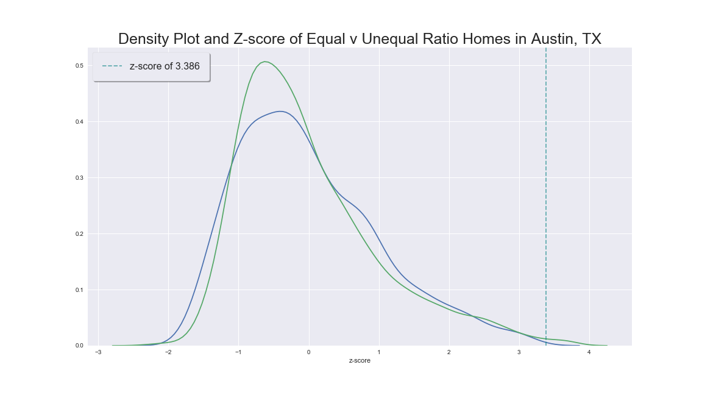

# Austin Real Estate Analysis

Austin’s real estate market is undeniably on the rise.  The growing economy and been a highlight of the cities allure, along with being named the best place to live in the US on 3 consecutive years: 2017, 2018, and 2019 by U.S News & World Report.  My analysis dives into the current Austin real estate market, from a bedroom to bathroom ratio starting point.  Does the bed-to-bath ratio of homes have a statistical impact to the value of homes?   

## Table of Contents

* [General Information](#general-information)
    * [Data Gathering](#data-gathering)
    * [Hypothesis Testing](#hypothesis-testing)
    * [Methodology](#methodology)
* [Technologies](#technologies)
    * [Database](#database)
    * [Python](#python)
    * [Visualization](#visualization)
* [Setup](#setup)

## General Information
Investing in a home is a milestone many aim to achieve, whether viewed as just a starter home or potential AirBnB investment, it all begins with data.  This project began with just a simple believe to be tested: The ratio between bedrooms to bathrooms have an impact on home values. But it’s potential with further enrichment is quite limitless. 

### Data Gathering:

### Hypothesis Testing:

###### Step 1: Set up the hypothesis
The null hypothesis is that the ratio between bedrooms to bathrooms has no statistically significant difference to the mean value of homes.

Alternative hypothesis is that there is a significant difference to the mean value

>**H0: μ = μ 0**

>**H1: μ ≠ μ 0 **

###### Step 2: Select test statistic
To test this hypothesis the z-test was chosen.
The significance level was set at: 0.05

A z-test is a statistical test used to determine whether two population means are different when the variances are known and the sample size is large.

  

###### Step 3: Set up decision rule

  

###### Step 4: Compute the test statistic
This will be a two-tailed test

###### Step 5: Conclusion
Given the results of our test we reject H0 that the means are the same, due to the z-score is 3.386 with a p-value well below our 0.05 significance level. This means there is enough evidence to say that ratios between homes do have an effect on home values.

Sample information:
-------------------------------
Adjusted equal sample-size: 1,424   
Adjusted unequal sample-size: 2,894

### Methodology:

Data used in the study included square footage, number of beds, baths, and value for all single and multi-family homes, condo, and townhomes with active listings in the Austin housing market from December 2019 to January 2020, inside the city limits.  This data was used to calculate averages and test for significance between equal ratio vs unequal ratio homes. All figures shown in the article represent the mean value for each data point unless otherwise specified. The IQR (interquartile range) method of outlier detection was implemented as part of the data cleansing process.

## Technologies

  

      

        
        
        
          
Python: pandas, scipy, matplotlib, pymongo, sklearn, folium

      

  

  

  

  

  

Mongodb
Tableau
Docker

## Setup